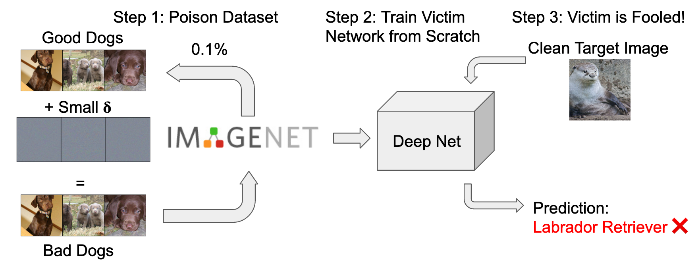

# Industrial Scale Data Poisoning via Gradient Matching


This framework implements data poisoning through gradient matching, a strategy that reliably applies imperceptible adversarial patterns to training data. If this training data is later used to train an entirely new model, this new model will misclassify specific target images. This is an instance of a targeted data poisoning attack.
The framework was written by [Liam Fowl](https://github.com/lhfowl) and me.



## Publication:
You can find our preprint at: https://arxiv.org/abs/2009.02276

#### Abstract:
Data Poisoning attacks involve an attacker modifying training data to maliciously control a model trained on this data.  Previous poisoning attacks against deepneural networks have been limited in scope and success, working only in simplifiedsettings or being prohibitively expensive for large datasets.   In this work,  wefocus on a particularly malicious poisoning attack that is both "from scratch" and"clean label", meaning we analyze an attack that successfully works against new,randomly initialized models, and is nearly imperceptible to humans, all whileperturbing only a small fraction of the training data. The central mechanism of thisattack is matching the gradient direction of malicious examples. We analyze whythis works, supplement with practical considerations. and show its threat to real-world practitioners, finding that it is the first poisoning method to cause targetedmisclassification in modern deep networks trained from scratch on a full-sized,poisoned ImageNet dataset.  Finally we demonstrate the limitations of existingdefensive strategies against such an attack, concluding that data poisoning is acredible threat, even for large-scale deep learning systems.


### Dependencies:
* PyTorch => 1.6.*
* torchvision > 0.5.*
- efficientnet_pytorch [```pip install --upgrade efficientnet-pytorch``` only if EfficientNet is used]
* python-lmdb [only if datasets are supposed to be written to an LMDB]


## USAGE:

The cmd-line script ```brew_poison.py``` can be run with default parameters to get a first impression for a ResNet18 on CIFAR10.

### ImageNet Example
To poison ImageNet for a ResNet34 with epsilon bound 8, changing 0.1% of the full training dataset, use
```python brew_poison.py --net ResNet34 --eps 8 --budget 0.001 --pretrained --dataset ImageNet --data_path /your/path/to/ImageNet --pbatch 128 ```

### Cmd-Line Interface Usage:

The cmd-script features a ton of arguments, most of which are very optional. Important parameters are:
* ```--net```: Choose the neural network that is being poisoned. Current options:
    - *CIFAR/MNIST*: ```ResNet-``` variants including WideResNets via ```ResNet-DEPTH-WIDTH```, ```MobileNetV2```, a ```ConvNet```, ```Linear```, ```VGG``` variants
    - *ImageNet*: All torchvision models (https://pytorch.org/docs/stable/torchvision/models.html), ```Linear``` and EfficientNet (https://github.com/lukemelas/EfficientNet-PyTorch)
* ```--dataset```: Choose the dataset from ```CIFAR10```, ```CIFAR100```, ```MNIST``` and ```ImageNet```
* ```--eps```, ```--budget``` and ```--targets``` control the strength of the attack
* ```--ensemble``` controls the number of networks used to brew the poison.
* ```--threatmodel```: Poisoning can work in a variety of threat models. Options: ```single-class```, ```third-party``` and ```random-subset```


We also implement some related methods, aside from Gradient Matching.
* Watermarking (Sanity Check) [also featured in https://arxiv.org/abs/1804.00792]
* Poison Frogs https://arxiv.org/abs/1804.00792
* MetaPoison https://arxiv.org/abs/2004.00225 [only for the case of an ensemble of 1, refer to https://github.com/wronnyhuang/metapoison for efficient code for large ensembles]

A method can be chosen by changing ```--recipe```: Choose the poison strategy from ```gradient-matching```, ```gradient-matching-private```, ```poison-frogs```, ```watermark``` and ```metapoison```.

All possible arguments can be found under ```forest/options.py```.


## Framework Basics:

This framework implements an interface into several dataloaders and dataset subsets in the ```Kettle``` class.
The training procedure is implemented in the ```Victim``` class and its subclasses implement different backends.
The ```Witch``` classes implement a poison attack for a given victim and kettle and return ```poison_delta```.

A point to note: ```poison_delta``` stores only the adversarial pattern, not the image. These patterns are added to their
corresponding images when necessary according to the ```poison_ids``` stored in the kettle.


To implement a new attack, have a look at the method ```_brew``` in ```witchcoven/witch_watermark``` and implement a
similar method. Then register a new class in the ```witchcoven/__init__``` interface. Attacks that are conceptually similar to Poison Frogs or Gradient Matching can also implement a different ```_define_objective``` method and inherit the ```_brew``` structure from the base class.


## Poisoning Benchmark
We also support attacks against the poisoning benchmark of https://github.com/aks2203/poisoning-benchmark. Runfiles for the benchmark can be created using the ```benchmark_gen.py```script. To brew poisoned datasets for this benchmark, refer to the autocreated```benchmark_poison_brewing.sh``` script. To evaluate these poisoned datasets against the benchmark, run ```benchmark_poison_evaluation.sh```, assuming the github repository of the benchmark is in the same folder level as this repository.


Precomputed poisoned data for benchmark results based on gradient matching can be found at https://www.dropbox.com/sh/y8bwq0fqqkcz36d/AAC58nZRwRRtKDsn-rk8S1hca?dl=0.

## Examples of poisoned datasets

More examples of pre-computed poisoned datasets can be found at
https://www.dropbox.com/sh/y8bwq0fqqkcz36d/AAC58nZRwRRtKDsn-rk8S1hca?dl=0.


### Distributed Training

Using model ensembles to brew transferable poisons is *very* parallel. We make us of this by launching via
```
python -m torch.distributed.launch --nproc_per_node=GPUs_per_node --master_port=20704\
          dist_brew_poison.py --extra_args
```
on a single-node setup with multiple GPUs.

Running on a multi-node setup, the launch command is slightly different:
##### SLURM:
```
python -m torch.distributed.launch --nproc_per_node=$SLURM_GPUS_PER_NODE
          --nnodes=$SLURM_JOB_NUM_NODES --node_rank=$SLURM_NODEID\
          --master_addr="192.168.1.1" --master_port=11234 \
          dist_brew_poison.py --extra_args
```

#### PBS:
```
python -m torch.distributed.launch --nproc_per_node=4
          --nnodes=$PBS_NUM_NODES --node_rank=$PBS_O_NODENUM \
          --master_addr="192.168.1.1" --master_port=11234 \
          dist_brew_poison.py --extra_args
```
See https://github.com/pytorch/pytorch/blob/master/torch/distributed/launch.py for details.

## Randomization

Poisoning is highly dependent on the choice of target class, source class and poisoned images. Rerunning the ```brew_poison.py``` script draws a random target image from a random class and random poison images from another class every time it is called. This might lead to very different results, as there are very easy and very hard examples.

To control against this effect take note of the hash printed during the initalization of the kettle. Starting a new run with the optional argument ```--poisonkey``` will rerun the same experiment with the same setup.


To have a small "validation set" for poisoning strategies we used the following ids in the paper.

```
python brew_poison.py --vruns 8 --poisonkey 2000000000
python brew_poison.py --vruns 8 --poisonkey 2100000000
python brew_poison.py --vruns 8 --poisonkey 2110000000
python brew_poison.py --vruns 8 --poisonkey 2111000000
python brew_poison.py --vruns 8 --poisonkey 2111100000
python brew_poison.py --vruns 8 --poisonkey 2111110000
python brew_poison.py --vruns 8 --poisonkey 2111111000
python brew_poison.py --vruns 8 --poisonkey 2111111100
python brew_poison.py --vruns 8 --poisonkey 2111111110
python brew_poison.py --vruns 8 --poisonkey 2111111111
```

Weaker poisoning strategies are also very volatile w.r.t to model parameters. Running the validation several times with new victim model initializations helps to control for this effect. This can be done by adding the argument ```--vruns```.
The model initialization can be fixed with ```--modelkey```, but as training is not set to be deterministic, small changes can materialize even when training from the same initialization. You can use ```--deterministic``` to switch cuDNN into its deterministic mode.
